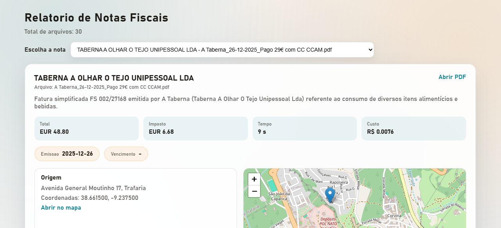
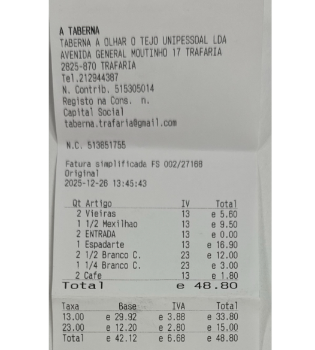
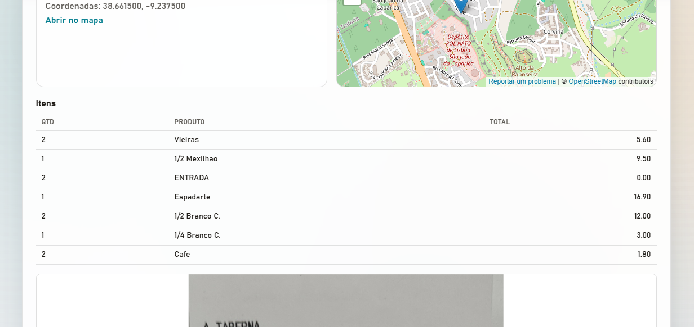
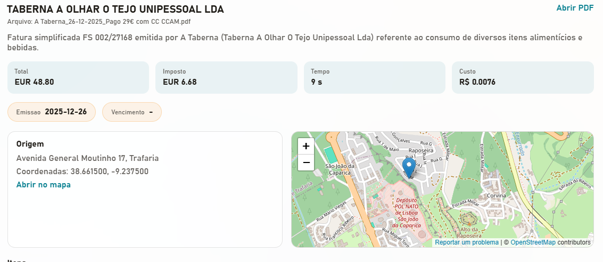

# Automacao de NFs - Relatorio de Notas Fiscais

## Contexto do projeto
Projeto de automacao desenvolvido para um cliente de Portugal, focado na analise de notas fiscais. Usei IA para estruturar os dados extraidos dos documentos e viabilizar a consolidacao no relatorio.

## Partes do relatorio
### Selecao de nota
O seletor permite localizar rapidamente uma nota pelo nome da empresa e pelo arquivo, mantendo a navegacao direta e organizada.

### Cartao da nota
O cabecalho do cartao resume a empresa e o arquivo da nota, com acesso direto ao PDF quando necessario.

### Indicadores principais
Os indicadores destacam valores-chave como total, imposto, tempo de processamento e custo, facilitando comparacoes.

### Itens da nota
Tabela detalhada com quantidade, descricao do produto e total por item, com leitura clara e objetiva.

### Origem e mapa
Bloco de origem com endereco, coordenadas e mapa para validacao rapida da localizacao aproximada da emissão da nota fiscal.

